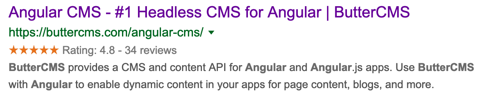
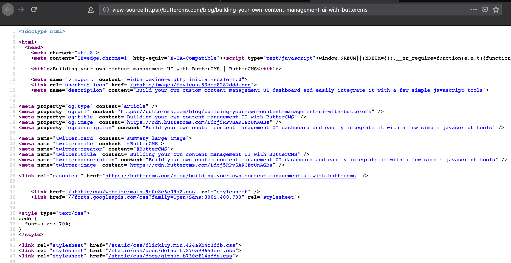

# A Complete, Dead-Simple Guide to SEO for Static Site Generators

## Introduction

Static site generators (SSGs) are tools to convert dynamic templates into static HTML pages. SSGs like Gatsby, Jekyll, and Hugo have been gaining popularity due to their ability to allow you to use templates and represent your blog as a series of components.

One of the most appealing thing about SSGs are that they provide better support for Search Engine Optimization (SEO) as compared to regular web pages. SEO allows you website to have greater visibility on search engines, which brings in more traffic to your site from relevant audiences. SSGs allow you to incorporate common SEO patterns into your site by using the appropriate components. 

In this post we will be looking into some strategies for developing these SEO-specific components. We will then look at how to implement these strategies with some popular SSG frameworks.

## Challenges posed by SSGs with respect to SEO

Although SSGs are better for SEO in the long run, there are a few challenges that we have to overcome when compared to static sites:

1. **Creating SEO templates** - in static sites, we can add the required titles and met tags for each page individually. In the case of SSGs, we need to create a template for these tags so that they can be autogenerated for each page.
2. **Generating sitemaps** - For a static site, we can manually update our sitemap once we add new pages. In the case of SSGs, since new pages are generated dynamically, sitemaps will in turn need to be generated automatically when building our site.
3. **Source code verification** - The HTML source code for a site plays a *huge* role in SEO. For static sites, you *know* the source code that will finally appear on the website. In the case of SSGs, however, there are normally so many components and templates that you'll need to verify the source code once the website is generated. 

Although the above points seem like challenges at first, they can be treated as benefits as well: Automating SEO templates and sitemap generation will actually reduce the time and effort you spend on SEO every time you add a new page, but requires an initial effort to set it all up.

## SEO strategies for SSGs

Let's discuss some strategies and concepts common to most SSGs for enabling SEO on your site.

### Adding titles and descriptions

Every webpage needs to have meta tags to describe their title and description. Here's an example from the ButterCMS [Angular CMS page](https://buttercms.com/docs/api-client/angular):

```html
<title>Angular CMS - #1 Headless CMS for Angular | ButterCMS</title>
<meta name="description" content="ButterCMS is an API-based CMS for Angular apps. Add marketing pages, blog and more to your Angular app in minutes.">
```

The title and meta description tags give search engines a brief overview about the content of the page. They are also sometimes used by search engines in their results page:



For SSGs, we will need to add in these tags as templates, that need to be filled in for each page:

```html
<title>{page title}</title>
<meta name="description" content="{page description}">
```

### Open graph image and summary tags:

When we paste some links on Twitter, like this [ButterCMS blog post](https://buttercms.com/blog/building-your-own-content-management-ui-with-buttercms), it displays a summary card with an image and description. like this:


This is made possible by the twitter and open graph meta tags:

```html
<meta property="og:type" content="article" />
<meta property="og:url" content="https://buttercms.com/blog/building-your-own-content-management-ui-with-buttercms" />
<meta property="og:title" content="Building your own content management UI with ButterCMS" />
<meta property="og:image" content="https://cdn.buttercms.com/Ldcj5RPvSAKCEcUnAGBs" />
<meta property="og:description" content="Build your own custom content management UI dashboard and easily integrate it with a few simple javascript tools" />

<meta name="twitter:card" content="summary_large_image">
<meta name="twitter:site" content="@ButterCMS">
<meta name="twitter:creator" content="@ButterCMS">
<meta name="twitter:title" content="Building your own content management UI with ButterCMS" />
<meta name="twitter:description" content="Build your own custom content management UI dashboard and easily integrate it with a few simple javascript tools" />
<meta name="twitter:image" content="https://cdn.buttercms.com/Ldcj5RPvSAKCEcUnAGBs" />
```

- The `twitter:card` tag tells Twitter about the type of card preview to be shown when someone pastes a link on their tweet. 
- The `twitter:image` tag provides the URL of the image to display on the card
- The `twitter:title` and `twitter:description` tags describe the title and summary text on the card respectively.

The `og` tags are specified by the [Open Graph Protocol](https://ogp.me/) and are used by other sites like Facebook and Google's rich snippets.

Each value of these tags would need to be templatized in to support SSGs:

The `twitter:card`, `twitter:site` and `twitter:creator` tags would remain same for every page on a website, while the `twitter:title`, `twitter:description` and `twitter:image` tags would change for each page:
```html
<meta name="twitter:card" content="summary_large_image">
<meta name="twitter:site" content="@ButterCMS">
<meta name="twitter:creator" content="@ButterCMS">
<meta name="twitter:title" content="{page title}" />
<meta name="twitter:description" content="{page description}" />
<meta name="twitter:image" content="{link to page banner image}" />
```

### Verifying the source code of web pages

Once your website is generated by the SSG, you will need some way top verify if the SEO related tags have actually been rendered as required. The easiest way to do this is by viewing the page source of your generated page.

This can be done by going to the browser, right clicking on a page, and selecting the "View Page Source" option:


This will take you to another page where the source code of the page can be seen:



Here, you can verify if the various meta tags are generated without error. This is the easiest and most fool proof way to verify SEO related tags, since the page source is the exact same information that is viewed by search engines when they crawl your site.

## SEO strategies for React based SSGs

SSGs like [Gatsby](https://www.gatsbyjs.org/) and [Next.js](https://nextjs.org/) use React as the templating library in addition to the application logic.

For these frameworks, the initial page HTML is generated on the server side and the React library, along with the application code is loaded later. We cannot just put in an HTML `head` element in our React components, since a component may be rendered multiple times depending on your application code, and this could lead to duplicate changes if each component needs to manipulate the pages `head` element differently.

Using libraries like [React Helmet](https://github.com/nfl/react-helmet) save you from the trouble of maintaining code for these cases, and takes care of updating the document head from any of your React components without duplication.

### Using React-helmet in your code


### The React-helmet library

How to integrate SEO tags into your HTML head element using [React Helmet](https://github.com/nfl/react-helmet)

- Adding meta titles and descriptions in React
- Adding open graph image and summary tags (for showing rich formatted cards when sharing on twitter or facebook)
- How to verify the source code for pages once they are generated

## SEO strategies for Jekyll sites

Where they  shd  sjskn

- Using ERB templates to define the meta titles and descriptions in Jekylls head element
- Adding open graph image and summary tags (for showing rich formatted cards when sharing on twitter or facebook)
- How to verify the source code for pages once they are generated

## SEO strategies for Hugo based sites

- Using Hugos Go templates to define the meta titles and descriptions in Jekylls head element
- Adding open graph image and summary tags (for showing rich formatted cards when sharing on twitter or facebook)
- How to verify the source code for pages once they are generated

## Conclusion

Recap of the tasks we performed, and a few sentences on how these concepts can be carried forward to other SSGs of the readers choice.